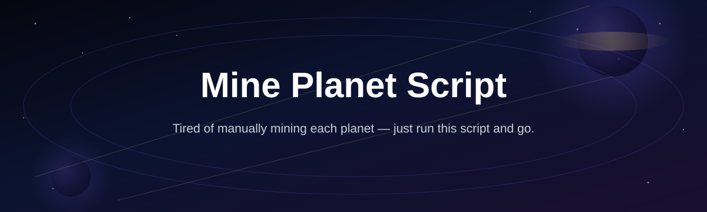
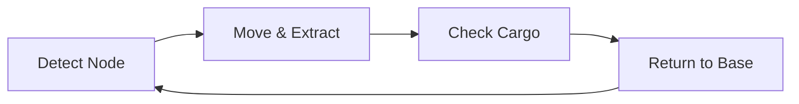

# planet-mining-script

*A weekend-built automation script for players who'd rather explore than babysit a mining queue.*

## What this is

**What this is NOT**: a game mod, a server-side tool, or anything that touches multiplayer state you don't own. It doesn't inject into memory, doesn't patch game files, and doesn't promise infinite resources overnight. If you were looking for something that edits save data directly, this isn't it.

What it **is**: planet-mining-script is a standalone Windows automation utility built for space-mining and colony-survival style games where resource extraction is repetitive by design. It reads what's on screen, drives input the same way a human player would, and runs a mining loop — travel to a node, extract, return, repeat — so you can step away from the keyboard during the boring parts and come back for the decisions that actually matter. It was built over a few weekends by one player who got tired of clicking the same asteroid forty times, and it's shared as-is for anyone with the same problem.

  

The button above opens the project's download page.

## Who it is for

| Audience | Why they'd use it |
|---|---|
| Solo space-sim players | Automate long resource-gathering loops during single-player sessions |
| Colony-builder grinders | Keep raw material stock topped up without manual clicking |
| Streamers running idle segments | Let the mining loop run on a second monitor while chatting |
| Players returning after a break | Catch up on resource stockpiles without relearning tedious loops |
| Script tinkerers | Use it as a base to adjust timing and node logic for their own game |

## What you can do

| Capability | Detail |
|---|---|
| **Queue a mining route** | Set a sequence of nodes and the script cycles through them in order |
| **Auto-detect full cargo** | Stops the loop and returns to base when your hold is full |
| **Adjustable timing** | Tune delays between actions to match your game's animation speed |
| **Run in the background** | Minimize the script window while it keeps clicking and reading state |
| **Pause and resume instantly** | One hotkey stops the loop mid-cycle without closing the app |
| **Log every cycle** | See a simple run log of nodes visited and cargo collected per pass |
| **No install footprint** | Single .exe, no registry writes, delete the folder when you're done |
| **Works with keyboard or mouse profiles** | Choose which input method matches your game's controls |

## Getting started

1. Open the download page using the button above.
2. Download the latest `.exe` release for Windows.
3. Extract it to any folder — no installer, no setup wizard.
4. Launch your game first, then run `planet-mining-script.exe`.
5. Set your route, hit start, and let it cycle.

## Requirements

- Windows 10 or Windows 11 (64-bit)
- No Python, Node, or build toolchain needed — it's a standalone executable
- A game window running in windowed or borderless mode
- Roughly 20 MB of free disk space

## How it works

1. The script reads a small region of your screen to detect game state (cargo, node availability).
2. It sends simulated keyboard/mouse input matching the route you configured.
3. After each mining pass, it checks cargo status and cycles back or extracts further.
4. When cargo is full, it returns automatically and logs the run.

## FAQ

**Does this work with any planet-mining game, or is it tied to one title?**
It's built to be screen-and-input based, so it works with most games that have a repeatable node-extraction loop, but timing profiles are tuned per game. Check the download page for a current compatibility list.

**Will this get my account flagged in a multiplayer game?**
Any automation in a multiplayer environment carries risk depending on that game's terms of service. This tool is intended for single-player or offline sessions — use judgment for anything with an online component.

**Can I run this on Mac or Linux?**
Not currently. It's built and tested for Windows 10/11 only.

**Does it need admin rights to run?**
No. It runs as a normal user application. Some games with anti-cheat overlays may require you to run it elevated to interact correctly — that's a game-specific quirk, not a script requirement.

**How do I change what counts as a "full cargo hold"?**
There's a threshold setting in the script's config panel where you set the detection value that matches your game's cargo indicator.

## Troubleshooting

**Script doesn't detect my cargo status** — Recalibrate the screen region in settings; resolution or UI scale changes will shift detection zones.

**Inputs aren't registering in-game** — Some games block simulated input by default. Try running the game in windowed mode and confirm the game window has focus.

**Route loop stalls after one cycle** — Increase the delay between actions; games with slower load animations need longer wait times than the default.

**Antivirus flags the .exe** — This is common for input-automation tools with no code signature yet. Verify the download source matches the official project page before allowing it.

## License

Released under the [MIT License](LICENSE). Use this software at your own risk and in accordance with the terms of service of any game you run it with. No warranty is provided or implied.

  

